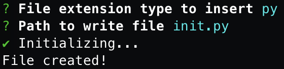
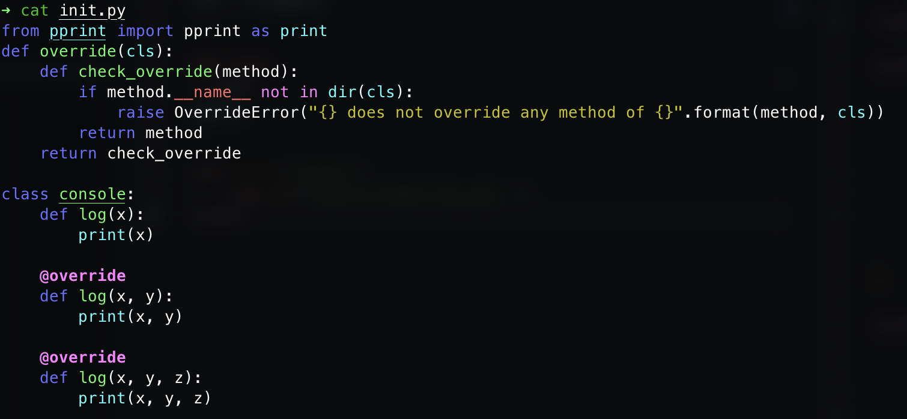

<div align='center'>

## A compact CLI to initialize (python) project 

</div>

### Installation 

```bash
npm i -g pyproj
```

### Usage 
```bash
pyproj 
```

<div align='center'>
    
</div>

<div align='center'>
    
</div>